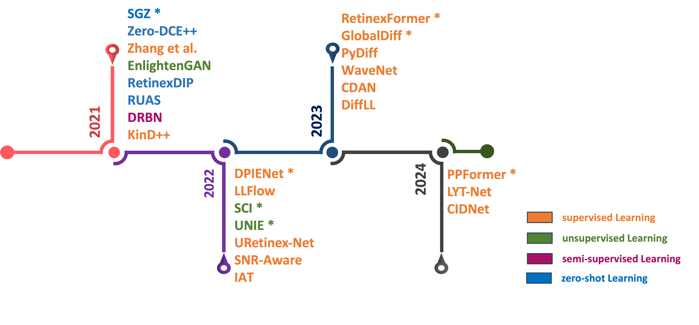

# Survey-on-Low-Light-Image-Enhancement-with-Deep-learning
A repository for the paper on 'A survey on Deep Learning Low Light Image Enhancement Algorithms'

To begin, download the [BDD100K dataset](https://dl.cv.ethz.ch/bdd100k/data/) (Specifically 100k_images_train and bdd100k_det_20_labels_trainval zip files), and run the data parsing code to seeded to reproduce the test images used for this survey.

Prof. Panetta's Vision Sensing and Simulations Lab
